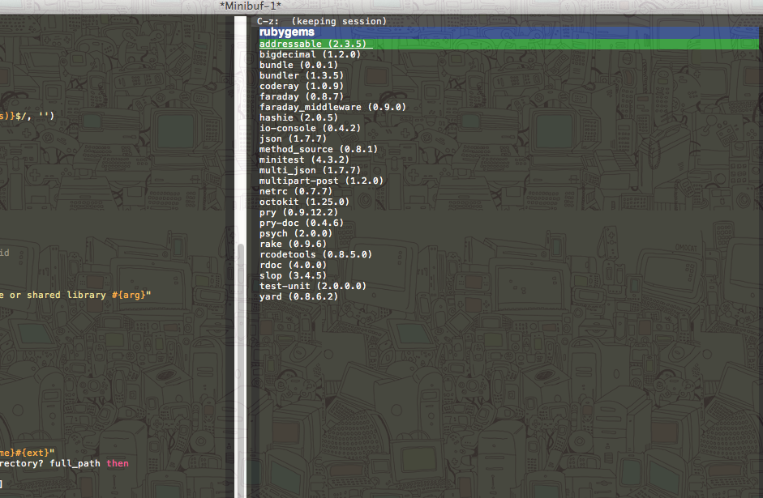

# anything-rubygems-local.el

Find installed rubygems lib directory for [anything](http://emacswiki.org/emacs/Anything ).

Ported from [f-kubotar/helm-rubygems-local](https://github.com/f-kubotar/helm-rubygems-local )

## Usage

### `M-x anything-rubygems-local`

`gem list` interface of anything, then use `gem which gem_name` to
find the gem source file.

(if `Gemfile` in current or parent directories, would use `bundle
list` for gem listing and `bundle show gem_name` for gem locating)

anything source is `anything-c-source-rubygems-local`.
